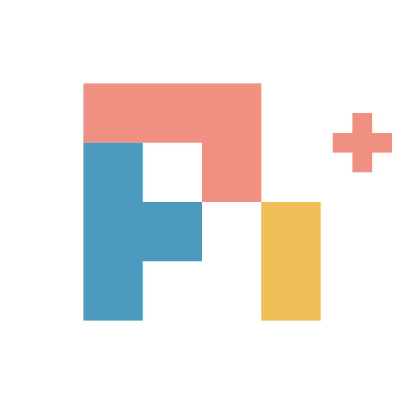

<div align="center">



**Remote control, shared subscriptions, and multi-agent tools for [pi](https://pi.dev/).**

[](https://www.npmjs.com/package/@jameslovespancakes/pi-plus)
[](https://github.com/jameslovespancakes/pi-plus/actions/workflows/ci.yml)
[](LICENSE)

[Changelog](CHANGELOG.md) · [Releases](https://github.com/jameslovespancakes/pi-plus/releases)

</div>

## Install

Requires **pi 0.87.1+**.

```sh
pi install npm:@jameslovespancakes/pi-plus
```

Run **`/pi-plus`** to see your setup and configure each feature.

---

## Remote Control

**Keep working from your phone.** Message your local pi session from the Claude
app or [claude.ai/code](https://claude.ai/code). Prompts queue while pi is busy;
the app's Stop button stops the agent. Your selected model still runs through pi.

```text
──────────────────────────────────────
 Remote Control
› ● Remote Control              On
──────────────────────────────────────
```

**`/claude-remote`** toggles On/Off. On connects now and auto-starts in future
interactive sessions; Off disconnects and disables auto-start. The footer dot
is green when connected and red otherwise.

Off by default. Requires your primary Anthropic OAuth login via `/login`.
Experimental: text input and completed-message mirroring, not token streaming.
Remote model changes and permission approvals are not supported.

**Privacy:** enabling uploads new messages, thinking, images, and tool
arguments/results to Anthropic and lets that Claude account control your local
agent. Past history and system prompts are not mirrored. Turning it off does
not delete uploaded content. Set `PI_CLAUDE_REMOTE_ALLOW_INBOUND=0` for read-only;
accounts requiring device verification can supply `CLAUDE_TRUSTED_DEVICE_TOKEN`.

## Messaging Board

**Keep agents coordinated across sessions and machines.** Shared project rooms,
direct messages, live presence, and coordinator assignments let agents exchange
progress without duplicating work.

```text
 Messaging Board · Active
 repo:project │ reviewer │ builder

 reviewer   Tests pass. Ready for review.
 builder    Picking up the next task.

 Message >
```

**`/board setup`** configures a local or SSH-hosted board server.
**`/board`** opens the chat. Presence stays out of model context; only requested
board data and actual messages are delivered.

## Subscriptions

**Use your available capacity instead of managing accounts by hand.** Pool
multiple subscriptions, route by account order or remaining quota, and see
usage in the footer. Supports Anthropic, OpenAI Codex, Gemini, Kimi Code, and xAI.

```text
 Claude Σ2 · 2/2 ready
 5h      █████████████░░░░░░░   65%
 weekly  ███████████░░░░░░░░░   58%
 Work 72% · Personal 58%
```

**`/accounts`** adds, reauthorizes, and toggles accounts.
**`/routing quota-aware`** uses reported capacity; **`/routing sequential`**
follows account order. **`/usage`** refreshes the bars.

Quota visibility depends on the provider. Where no usage endpoint exists,
pi-plus shows the last observed rate-limit reading rather than inventing one.

## Model Information

**Choose on evidence, not guesswork.** Compare Artificial Analysis benchmarks,
price, speed, and remaining subscription quota in one catalog.

```text
 Benchmarks + price + speed + quota
                  ↓
        Better-informed selection
```

**`/model-info setup`** connects your benchmark key. **`/models`** opens the
ranked catalog; the **`list_models`** tool gives agents the same information.

## Provider Controls

**Decide which providers may spend.** Gate metered providers at the request
boundary, including workflow subagents—not just through prompt instructions.

```text
──────────────────────────────────────
 Providers
› ● Anthropic              Allowed
  ● OpenRouter             Needs Approval
──────────────────────────────────────
```

**`/provider`** opens the picker. Enter or Space toggles access in place.

## Workflows

**Turn repeatable tasks into coordinated agent runs.** Built-in reviews,
diagnostics, research, and refactoring workflows support parallel agents,
worktree isolation, replay, and usage accounting. Every run returns immediately;
results arrive when it finishes. There is no separate foreground/background mode.

```text
 Task → parallel agents → findings → result
```

```sh
/workflow code-review HEAD~3
/workflow research "Compare the available approaches"
```

**`/workflow`** opens the running agent board. Enter inspects, Esc goes back,
and X stops the selected agent from the list. Inspection needs at least 80×24.
The inspector uses pi's native message/tool rendering and editor. Enter steers;
Alt+Enter queues a follow-up. `/model provider/model` and `/thinking level`
affect only that agent. Other parent-session commands are not forwarded.

Every `api.agent()` call requires `label`, `model`, and `thinkingLevel`.
Built-ins resolve explicit routes with `api.modelProfile("small" | "medium")`;
configure both routes in `.pi/workflow-models.json` (or the agent-directory
`workflow-models.json`), each with `model: "provider/model-id"` and
`thinkingLevel`. Missing routes now fail rather than inheriting the host model.
The file shape is `{ "profiles": { "small": { "model": "provider/model-id",
"thinkingLevel": "low" }, "medium": { "model": "provider/model-id",
"thinkingLevel": "high" } } }`.

The main agent can use `workflow({ action: "list" })`, or `inspect`/`stop` with
`runId` and optionally `agentId`. Activity is fetched on demand, not injected
into every turn. Limits on concurrency, agents, time, and output tokens remain
optional.

## Remote Workers

**Run tests and builds on the machine suited to them.** Snapshot your working
tree to an SSH worker after checking CPU, memory, disk, and GPU capacity.

```text
 Remote Workers
› ● build-box    READY
  ● gpu-node     READY
  ● laptop       UNREACHABLE
```

**`/remote setup`** selects or adds workers. Agents use **`remote_status`** and
**`remote_test`** to inspect capacity and execute commands. Uploaded source is
removed after the run by default; logs and results are retained.

---

## Configuration

Feature preferences live in **`~/.pi/agent/pi-plus.json`**. Environment variables
win over saved values. Credentials, account pools, and caches use separate
stores; pi remains responsible for its own authentication and session state.

For local development:

```sh
pi install /path/to/pi-plus
npm install && npm run verify
```

## Sources & Credits

| Project | Contribution |
| --- | --- |
| [pi](https://pi.dev/) | Host agent, extension API, session and authentication lifecycle |
| [claude-remote-lib](https://github.com/clepdn/claude-remote-lib) | Remote Control protocol ([provenance & license](src/core/claude-remote/UPSTREAM.md)) |
| [pi-claude-remote](https://github.com/clepdn/pi-claude-remote) | Behavior reference for the independently implemented remote adapter |
| [pi-workflow-engine](https://github.com/timbrinded/pi-workflow-engine) | Embedded workflow runtime ([MIT](src/domains/workflows/LICENSE.md)) |
| [pi-antigravity](https://github.com/Rahularya01/pi-antigravity) | Gemini provider reference ([MIT](src/core/gemini/LICENSE.md)) |
| [pi-anthropic-auth](https://github.com/cortexkit/anthropic-auth) | Original subscription integration, since reimplemented (MIT) |
| [xxhash-wasm](https://github.com/jungomi/xxhash-wasm) | Vendored billing checksum ([MIT](src/core/anthropic/vendor/xxhash-wasm.LICENSE.md)) |
| [Artificial Analysis](https://artificialanalysis.ai/) | Model benchmark data |

## Disclaimer

pi-plus is an unofficial, independent project—not affiliated with or endorsed by
pi, Anthropic, OpenAI, or other providers. Remote Control uses an unofficial
protocol that may change without notice.

**You are responsible for complying with each provider's terms**, including
subscription pooling and remote access. Review those terms before connecting
accounts. Features that mirror sessions or run remote jobs send data to those
services or machines.

Provided as is, without warranty. [MIT License](LICENSE).
