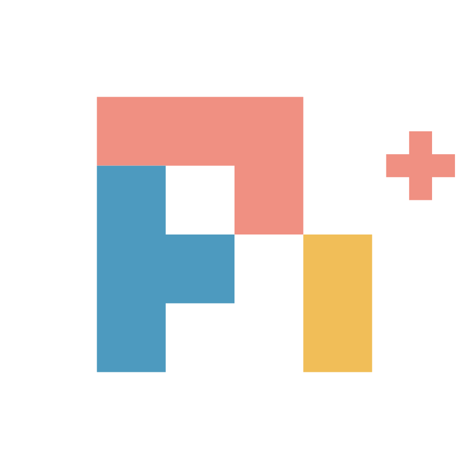

<div align="center">



**Remote control, shared subscriptions, and multi-agent tools for [pi](https://pi.dev/).**

[](https://www.npmjs.com/package/@jameslovespancakes/pi-plus)
[](https://github.com/jameslovespancakes/pi-plus/actions/workflows/ci.yml)
[](LICENSE)

[Changelog](CHANGELOG.md) · [Releases](https://github.com/jameslovespancakes/pi-plus/releases)

</div>

## Install

Requires **pi 0.87.1+**.

```sh
pi install npm:@jameslovespancakes/pi-plus
```

Run **`/pi-plus`** to see your setup and configure each feature.

---

## Remote Control

**Keep working from your phone.** Message your local pi session from the Claude
app or [claude.ai/code](https://claude.ai/code). Prompts queue while pi is busy;
the app's Stop button stops the agent. Your selected model still runs through pi.

```text
──────────────────────────────────────
 Remote Control
› ● Remote Control              On
──────────────────────────────────────
```

**`/claude-remote`** toggles On/Off for this session only. Startup, new sessions,
resumes, forks, and reloads always start Off; old auto-start preferences are
ignored. Off disconnects immediately. The footer dot is green when connected
and red otherwise.

Off by default. Requires your primary Anthropic OAuth login via `/login`.
Experimental: text input and completed-message mirroring, not token streaming.
Remote model changes and permission approvals are not supported.

**Privacy:** enabling uploads new messages, thinking, images, and tool
arguments/results to Anthropic and lets that Claude account control your local
agent. Past history and system prompts are not mirrored. Turning it off does
not delete uploaded content. Set `PI_CLAUDE_REMOTE_ALLOW_INBOUND=0` for read-only;
accounts requiring device verification can supply `CLAUDE_TRUSTED_DEVICE_TOKEN`.

## Messaging Board

**Keep agents coordinated across sessions and machines.** Shared project rooms,
direct messages, live presence, and coordinator assignments let agents exchange
progress without duplicating work.

```text
 Messaging Board · Active
 repo:project │ reviewer │ builder

 reviewer   Tests pass. Ready for review.
 builder    Picking up the next task.

 Message >
```

**`/board setup`** configures a local or SSH-hosted board server.
**`/board`** opens the chat. Presence stays out of model context; only requested
board data and actual messages are delivered.

## Subscriptions

**Use your available capacity instead of managing accounts by hand.** Pool
multiple subscriptions, route by account order or remaining quota, and see
usage in the footer. Supports Anthropic, OpenAI Codex, Gemini, Kimi Code, and xAI.

```text
 Claude Σ2 · 2/2 ready
 5h      █████████████░░░░░░░   65%
 weekly  ███████████░░░░░░░░░   58%
 Work 72% · Personal 58%
```

**`/accounts`** adds, reauthorizes, and toggles accounts, including the primary
login. Disabled primary credentials stay in pi's auth store; requests use an
enabled added account instead. Reauthorize an existing added account with
`/accounts reauth <provider> <name>`; use pi's `/login <provider>` for a primary login.
**`/routing quota-aware`** uses reported capacity; **`/routing sequential`**
follows account order. **`/usage`** refreshes the bars.

Claude usage comes from response headers first, with a shared cached status
fetch when needed. Cooldowns survive restarts and are respected by `/usage`;
usage checks never generate model responses or consume inference tokens.
After limit failures, Claude, Codex, and Gemini can recheck the serving account's
non-inference usage endpoint. Checks are shared and throttled, honor available
cache data and server cooldowns, and never prevent failover if status is unavailable.
Model-specific allowances remain separate.

Gemini login and reauthorization confirm account access before reporting success.
If Google requires verification, its verification page opens through pi's auth UI;
complete it, then choose **check again**. Credentials are saved only after the
server confirms access. Background quota checks never open a browser; they point
you to `/login gemini` or `/accounts reauth gemini <name>` when verification is needed.

Quota visibility depends on the provider. Where no usage endpoint exists,
pi-plus shows the last observed rate-limit reading rather than inventing one.

## Model Information

**Choose on evidence, not guesswork.** Compare Artificial Analysis benchmarks,
price, speed, and remaining subscription quota in one catalog.

```text
 Benchmarks + price + speed + quota
                  ↓
        Better-informed selection
```

**`/model-info setup`** connects your benchmark key. **`/models`** opens the
ranked catalog; the **`list_models`** tool gives agents the same information.

## Provider Controls

**Decide which providers may spend.** Gate metered providers at the request
boundary, including workflow subagents—not just through prompt instructions.

```text
──────────────────────────────────────
 Providers
› ● Anthropic              Allowed
  ● OpenRouter             Off
──────────────────────────────────────
```

**`/provider`** opens the picker. Enter or Space toggles access in place.
OpenRouter cycles **Off → On → On (ZDR) → Off**. Grants are session-local;
explicit policy denials stay locked. Other providers keep their existing toggles.

**On (ZDR)** restricts OpenRouter inference to Zero Data Retention endpoints,
including workflow agents and compaction. No eligible endpoint means an error,
never a non-ZDR retry; fallback among ZDR endpoints is allowed. Native Chat
Completions and Anthropic Messages routes are supported; unsupported APIs or
custom endpoints fail closed. Ordinary On does not remove account-level privacy
rules. ZDR does not cover separately enabled search plugins or local session logs.

Commands: `/provider approve openrouter`, `/provider zdr openrouter`, and
`/provider remove openrouter`.

If upgrading from v1.0.23, restart pi once rather than using `/reload` so its old
provider guard is removed. Not every model has a ZDR endpoint; an unavailable
ZDR route is different from OpenRouter being Off.

## Workflows

**Turn repeatable tasks into coordinated agent runs.** Built-in reviews,
diagnostics, research, and refactoring workflows support parallel agents,
worktree isolation, replay, and usage accounting. Every run returns immediately;
results arrive when it finishes. There is no separate foreground/background mode.

Live and finished runs share readable titles (for example, `Trace Launch 3`),
with recorded cost beside the title when available. Completion appears immediately
as a compact inline result; expand it for the run ID and usage breakdown. The
parent receives a bounded result at its next safe turn boundary, or wakes if idle.
Cancellation is respected. Live widgets clear on completion, failure, pause, or
stop, and late progress updates cannot bring them back.

Pooled subscription requests automatically try other eligible accounts on the
same model, then make three further eligibility checks after waits of **10, 25,
and 60 seconds**. Server cooldowns and exhausted quota windows are respected;
without a reset hint, a temporary limit becomes eligible at the first fallback.
Recovery retries the pending request, not the agent or its completed tools.
There is no `agentRetries` setting. Once streamed output has been exposed,
automatic retries and workflow auto-resume stop rather than replaying it.

```text
 Task → parallel agents → findings → result
```

```sh
/workflow code-review HEAD~3
/workflow research "Compare the available approaches"
```

**`/workflow`** opens the running agent board. Enter inspects, Esc goes back,
and X stops the selected agent from the list. Inspection needs at least 80×24.
PgUp/PgDn scroll agent chat; Ctrl+Home/Ctrl+End jump to the start/end. Mouse-wheel
scrolling works where pi supplies mouse events (fullscreen mode). New output
keeps your reading position until you return to the bottom. The board no longer
shows a latest-output preview.
The inspector uses pi's native message/tool rendering and editor. Enter steers;
Alt+Enter queues a follow-up. `/model provider/model` and `/thinking level`
affect only that agent. Other parent-session commands are not forwarded.

Every `api.agent()` call requires `label`, `model`, and `thinkingLevel`.
Built-ins resolve explicit routes with `api.modelProfile("small" | "medium")`;
configure both routes in `.pi/workflow-models.json` (or the agent-directory
`workflow-models.json`), each with `model: "provider/model-id"` and
`thinkingLevel`. Missing routes now fail rather than inheriting the host model.
The file shape is `{ "profiles": { "small": { "model": "provider/model-id",
"thinkingLevel": "low" }, "medium": { "model": "provider/model-id",
"thinkingLevel": "high" } } }`.

The main agent can use `workflow({ action: "list" })`, or `inspect`/`stop` with
`runId` and optionally `agentId`. Status checks show only running/stopping agents;
inspection includes at most the last 10 visible transcript entries across the
shown agents, including actual tool output but excluding private thinking.
Lists are capped at 10 active runs and 20 agents total; inspection shows at most
20 agents, with bounded log text. Activity is fetched on demand, not injected
into every turn. Limits on concurrency, agents, time, and output tokens remain
optional.

## Remote Workers

**Run tests and builds on the machine suited to them.** Snapshot your working
tree to an SSH worker after checking CPU, memory, disk, and GPU capacity.

```text
 Remote Workers
› ● build-box    READY
  ● gpu-node     READY
  ● laptop       UNREACHABLE
```

**`/remote setup`** selects or adds workers. Agents use **`remote_status`** and
**`remote_test`** to inspect capacity and execute commands. Uploaded source is
removed after the run by default; logs and results are retained.

---

## Configuration

Feature preferences live in **`~/.pi/agent/pi-plus.json`**. Environment variables
win over saved values. Credentials, account pools, and caches use separate
stores; pi remains responsible for its own authentication and session state.

For local development:

```sh
pi install /path/to/pi-plus
npm install && npm run verify
```

## Source Architecture

- `src/core/`: shared configuration, storage, OAuth and process/SSH primitives.
- `src/providers/`: provider-specific auth, transport, quota and policy, plus shared account serving/recovery.
- `src/domains/`: seven thin pi extensions; workflows are grouped by execution, agents, runs, replay, workspace and UI.
- `src/ui/`: terminal components that render prepared data without provider rules.

[Architecture and ownership](https://github.com/jameslovespancakes/pi-plus/blob/main/docs/architecture.md)
are guarded by dependency and runtime-cycle tests. Existing credential and run
storage formats are preserved.

## Sources & Credits

| Project | Contribution |
| --- | --- |
| [pi](https://pi.dev/) | Host agent, extension API, session and authentication lifecycle |
| [claude-remote-lib](https://github.com/clepdn/claude-remote-lib) | Remote Control protocol ([provenance & license](src/providers/anthropic/remote-control/UPSTREAM.md)) |
| [pi-claude-remote](https://github.com/clepdn/pi-claude-remote) | Behavior reference for the independently implemented remote adapter |
| [pi-workflow-engine](https://github.com/timbrinded/pi-workflow-engine) | Embedded workflow runtime ([MIT](src/domains/workflows/LICENSE.md)) |
| [pi-antigravity](https://github.com/Rahularya01/pi-antigravity) | Gemini provider reference ([MIT](src/providers/gemini/LICENSE.md)) |
| [pi-anthropic-auth](https://github.com/cortexkit/anthropic-auth) | Original subscription integration, since reimplemented (MIT) |
| [xxhash-wasm](https://github.com/jungomi/xxhash-wasm) | Vendored billing checksum ([MIT](src/providers/anthropic/vendor/xxhash-wasm.LICENSE.md)) |
| [Artificial Analysis](https://artificialanalysis.ai/) | Model benchmark data |

## Disclaimer

pi-plus is an unofficial, independent project—not affiliated with or endorsed by
pi, Anthropic, OpenAI, or other providers. Remote Control uses an unofficial
protocol that may change without notice.

**You are responsible for complying with each provider's terms**, including
subscription pooling and remote access. Review those terms before connecting
accounts. Features that mirror sessions or run remote jobs send data to those
services or machines.

Provided as is, without warranty. [MIT License](LICENSE).
